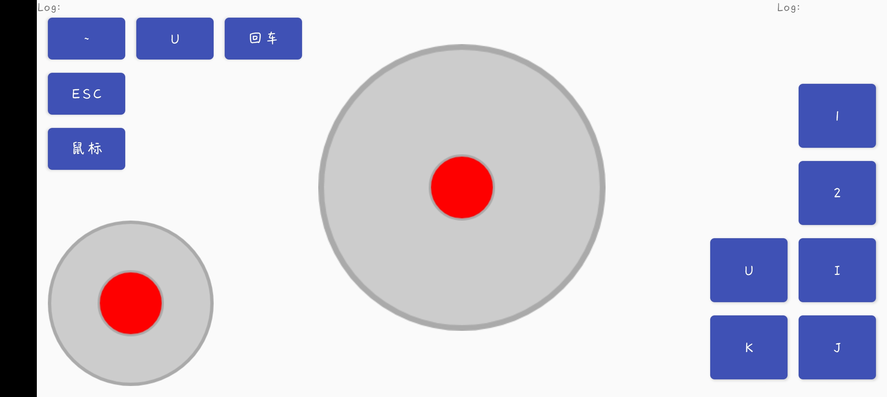

# gamepadforhonkaionAndroid-client
gamepadforhonkaionAndroid-client

this is an Android Apps to do gamepad's job
这是一个能让手机实现手柄部分功能的应用

build this project and run on Android device
run the C++ server and game on Windows deivce
Android's Wifi connect to the hot spots of Windows computer
then, you can operate your computer by your Android just like a gamepad.
编译这个项目并且将它运行在安卓设备上
在Windows电脑上运行配套的服务器和游戏
安卓设备连接电脑开的热点
然后就能像手柄一样操作你的电脑了

Here is a Screenshot of the App
下面是一张截图

